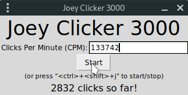

# Joey Clicker 3000



- Want to be able to make 133742 clicks per second?
- Want to be the first person to click on a button on a website when it appears?
- Want to destroy CookieClicker?
- Want to unleash the "Joey-la-clique" inside you?

This tool is made for you!

## Installation

This tool requires [**Python 3**](https://www.python.org/) and the packages **tkinter** and [**pynput**](https://pypi.org/project/pynput/). The former is usually provided with your python installation, and the latter can be installed with [**pip**](https://pypi.org/project/pip/) using:

```sh
$ path/to/python -m pip install pynput
```

Then clone this repo or download `joey_clicker_3000.py` and you're ready to click dementedly.

## Running

To execute this simple but astonishing tool, just launch `joey_clicker_3000.py` from a terminal:

### On Linux

```sh
$ ./joey_clicker_3000.py
```

### On Windows

```bash
> path/to/python joey_clicker_3000.py
```
